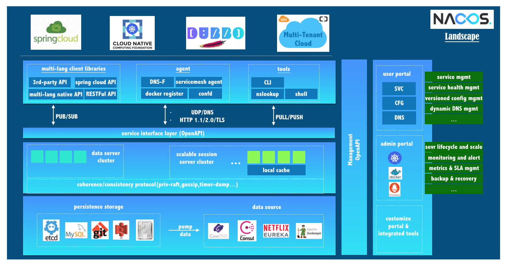

# What is Nacos

## Overview

Welcome to Nacos!

Nacos is all things about discovery, configure and manage your microservices. Nacos provides users with an easy-to-use feature set for dynamic service discovery, service configuration management, service and traffic management.

Nacos help users to build, deliver and manage their microservices platform more agile and easier. Nacos is a service infra when users build modern service centric applications by using microservices or cloud native approaches.

## What is Nacos？

Service is a first-class citizen in Nacos，Nacos support discovery，configure and manage almost all types of services such as，[Kubernetes service]()，[gRPC/Dubbo service](xx) or [Spring Cloud RESTful service](xx).

The key features of Nacos are:

* **Service Discovery And Service Health Check**

    Nacos supports both DNS-based and RPC-based (Dubbo/gRPC) service discovery, producer can register a service with [native sdk](xx) or [OpenAPI](xx) or by using [a dedicated agent](xx), consumer can discovery this service with either [DNS](xx) or [HTTP](xx).

    Nacos also do real-time health check for services to prevent sending requests to unhealthy hosts, Nacos support either transport layer (ping or tcp) or application layer (http, redis, mysql, user-define) health check. For complex cloud environments and network topology(VPC, Edge Service etc), Nacos provides both agent mode or server mode health check. Nacos also provide a unity service health dashboard to help to manage the availability and traffic for services.    
    
* **Dynamic Configuration Management**

    Dynamic configuration service allows you to manage the configuration of all applications or services in a centralized, externalized and dynamic manner across all environments.

    Dynamic configuration eliminates the need to redeploy applications and services when configuring updates.

    It can be more convenient to help you achieve stateless services and more easily elastic expansion of service instances on-demand.

    Naocs provide an [easy-to-use UI](xx) to help you management all of your configurations and provide some out-of-box features such as config version track, canary release and rollback config, client configuration update status tracking etc.

* **Dynamic DNS Service**

    Dynamic DNS services that support weighted routing make it easier for you to implement mid-tier load balancing, flexible routing policies, traffic control, and simple DNS resolution services in your production environment within your data center, helping you to more easily implement DNS-based Service discovery. Nacos provide some simple [DNS APIs](xx) for managing your DNS domain name and IPs.

* **Service Governance and MetaData Management**

   Nacos support manage all for your services and their metadata from the perspective of building the microservices platform. This includes manage the service description, life cycle, static dependencies analysis, service health status, service traffic management，routing and security rules, service SLA and first line metrics et al.

* [Check More Features ...](xx)

## Nacos Landscape

 

As the above Nacos landscape shows, Nacos seamless support many open source encology,such as [Dubbo and Dubbo Mesh](xx), [Spring Cloud](xx)， [Kubernetes and CNCF](xx).

With Nacos, you can take the advantage of various aspects of Nacos's capabilities to simplify your solutions in service discovery, configuration management, service governance and management, Nacos help to manage your micro-services on these platforms more easier.

For how touse Nacos with other open source products, check following docs :

[Use Nacos with Kubernetes](xx)
[Use Nacos with Dubbo](xx)
[Use Nacos with gRPC](xx)
[Use Nacos with Spring Cloud](xx)
[Use Nacos with lstio](xx)

## Basic Architecture and Concepts 

 

* **Naming Service** - define aa
* **Service Registry** - define aa
* **Domain** - define aa
* **Configuration** - define aa
* **Service MetaData** -  define aa
* **Producer** - define aa
* **Consumer** - define aa
[more concepts...]

## What’s next

Continue onwards with [quick start](xxx) to get Nacos up and running.

