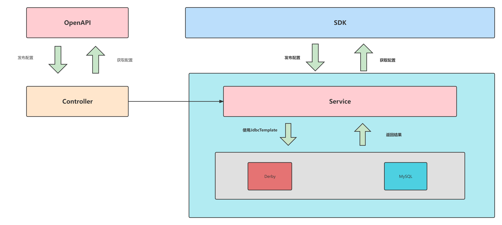

# 多数据源插件
Nacos从2.1.1版本开始,可通过SPI机制注入多数据源实现插件,并自动通过读取`application.properties`配置文件中`spring.datasource.platform`配置项选择加载对应多数据源插件.本文档详细介绍一个多数据源插件如何实现以及如何使其生效。

> 注意:
> 目前多数据源插件处于Beta测试阶段,其API及接口方法定义可能会在后续版本升级而有较大修改，请注意您的插件适用版本。

# 插件化实现
在原来的Config模块中，所有的SQL操作的执行是通过直接使用JdbcTemplate执行固定SQL语句的形式，使得SQL语句与业务逻辑高度耦合，并且只支持Derby与MySQL两种数据源，原有Config模块架构如下。

现在的多数据源插件通过SPI机制，将SQL操作按照数据表进行抽象出多个Mapper接口，Mapper接口的实现类需要按照不同的数据源编写对应的SQL实现;
现在插件默认提供Derby以及MySQL的Mapper实现，可直接使用，改造后架构图如下。

# 如何使用
1. 用户查询当前Nacos是否支持所需数据源，若支持则进行第2步，不支持则进行第3步；
2. 在`application.properties`配置文件中将`spring.datasource.platform`修改为对应的数据源名称，然后编译运行则可运行多数据源；
3. 不支持则可以自己编写数据源插件，编写数据源插件步骤见下；

# 自定义其他数据源插件
1. 首先在`com.alibaba.nacos.plugin.datasource.constants.DataSourceConstant.java`类中加入一个String常量标识其所属数据源，作用是告知Config模块根据此名称读取Mapper；
2. 其次在`com.alibaba.nacos.plugin.datasource.impl`中实现所有Mapper接口的方法，并将其路径放入`META-INF\services\com.alibaba.nacos.plugin.datasource.mapper.Mapper`中，即可完成其他数据源插件的编写；

Tips:此处Mapper的SQL分类是第一版,未来可能会有较大变动以及更新.

# 未来方案
未来的版本更新如下:
- [ ] 继续细分SQL，在现有的基础上，减少SQL语句的同时，对动态SQL的实现更加友好；
- [ ] 抽离不同数据源之间的差异列表，并通过配置文件或配置类的方式进行差异列表的替换，方便插件编写者；

# 其他数据源的实现
待补充