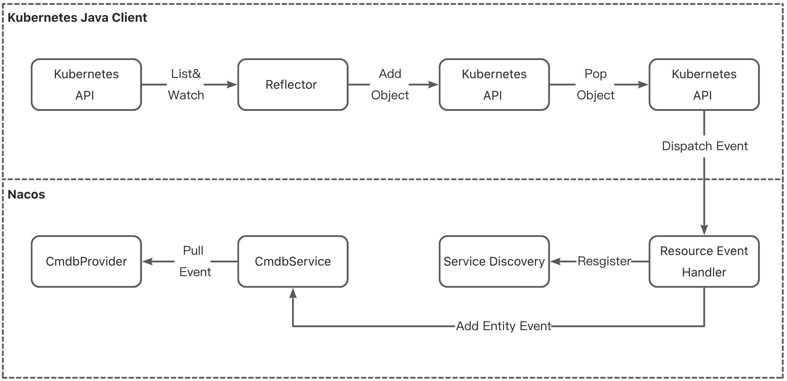

# Nacos支持从K8S服务发现中同步服务元数据

## 数据同步
Nacos监听K8S中服务和实例的变化情况，并获取其服务元数据，同步变更信息到Nacos的服务发现模块和实例中。支持K8S版本1.22（对应K8S-Java-API版本为14.0.0）。示意图如下：


K8S资源同步至Nacos资源的映射方案（单向，Nacos资源同步至K8S资源待补充）：


K8S中需要同步的数据|K8S中的字段|映射到Nacos中的字段
---|---|---
service name|service.metadata.name|service.name
service targetPort(pod port)(多个)|service.ports.targetPort|instance.port
service name|service.metadata.name|instance.cluster
service port(多个)|service.ports.port|instance.extendData<String, Object>
pod ip|pod.status.hostIP或者service.ipFamilies|instance.ip

## 配置文件
按照[部署文档](../guide/admin/deployment.md)搭建好Nacos集群。

配置application.properties文件，打开K8S同步的开关：
```
nacos.k8s.sync.enabled=true
```

如果是从K8S集群外的应用程序使用Java API，需要指定kubeConfig：
```
nacos.k8s.sync.outsideCluster=true
nacos.k8s.sync.kubeConfig=/.kube/config
```

配置完成后，K8S中的服务和实例变化时会自动同步到Nacos中。
